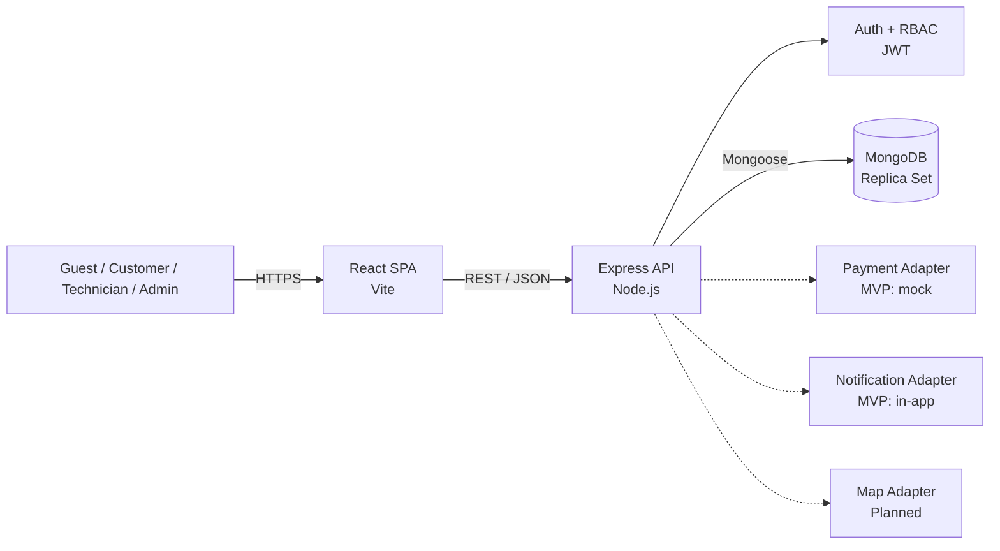
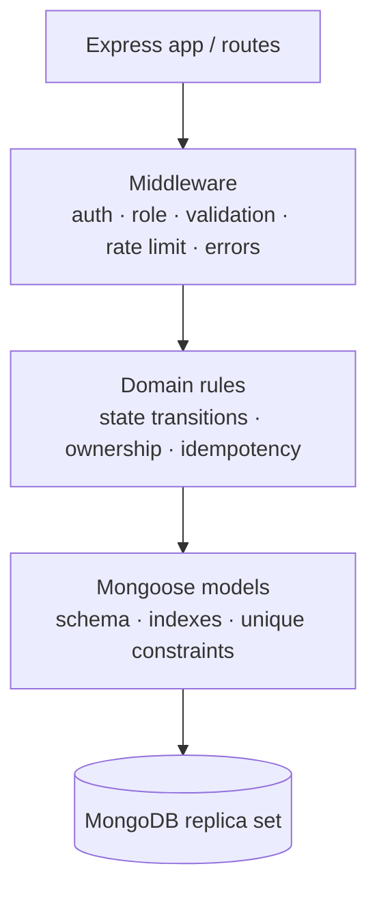
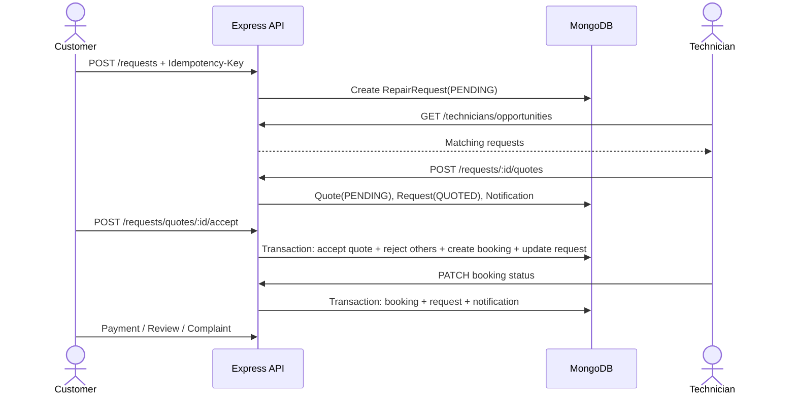
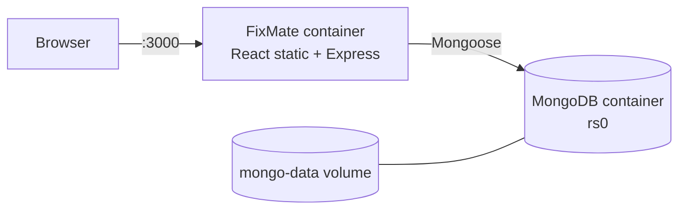

# Kiến trúc hệ thống FixMate V0.2

## 1. Mục tiêu thiết kế

Kiến trúc được nâng từ kho mã nguồn trống lên một modular monolith MERN. Cách này phù hợp giai đoạn MVP: triển khai đơn giản, giữ transaction nghiệp vụ trong một backend, nhưng vẫn tách router, model, middleware và service để có thể tách dịch vụ khi tải tăng.

## 2. Container architecture

## 3. Backend layers

| Layer | Trách nhiệm | Vị trí |
|---|---|---|
| UI | Landing page và dashboard theo vai trò | `client/src` |
| HTTP | Router và response REST | `server/src/routes` |
| Middleware | JWT, RBAC, error normalization | `server/src/middleware` |
| Domain | State machine dùng chung | `server/src/domain.js` |
| Application service | Notification và audit | `server/src/services` |
| Persistence | Schema, relationship, index | `server/src/models/index.js` |
| Runtime | Kết nối, graceful shutdown, seed | `server/src/server.js`, `seed.js` |

## 4. Luồng nghiệp vụ chính

## 5. Security architecture

- Mật khẩu băm bằng bcrypt với cost 12; mật khẩu không được trả về JSON và mặc định không được select.
- JWT HS256 có issuer, audience, hạn dùng và `authVersion`; role được đọc lại từ database ở mỗi request nên đổi quyền, logout hoặc đổi/reset mật khẩu có hiệu lực thu hồi session ngay.
- RBAC cho `CUSTOMER`, `TECHNICIAN`, `ADMIN`, kết hợp kiểm tra ownership ở cấp tài nguyên.
- Zod kiểm tra input và Mongoose kiểm tra lần hai ở lớp persistence.
- Helmet, CORS allow-list, giới hạn JSON 1 MB và rate limit riêng cho authentication.
- Audit log cho thao tác quản trị quan trọng.
- Secret và tài khoản admin đi qua environment; production từ chối chạy khi thiếu cấu hình quan trọng.

## 6. Reliability và scalability

- `Idempotency-Key` cùng unique compound index chống tạo trùng yêu cầu và thanh toán.
- Unique index bảo đảm một báo giá/thợ/yêu cầu, một booking/yêu cầu, một payment/booking và một review/booking.
- MongoDB transaction bảo đảm chấp nhận duy nhất một báo giá và đồng bộ trạng thái liên quan.
- Index theo customer, technician, service, status và thời gian hỗ trợ truy vấn chính.
- Phân trang có giới hạn tối đa 100 bản ghi.
- Graceful shutdown đóng HTTP server và MongoDB connection.
- Kiến trúc stateless ở lớp Express cho phép scale nhiều instance sau load balancer.

## 7. Deployment

`compose.yaml` cung cấp MongoDB replica set một node cho môi trường demo/development. Production nên dùng replica set ít nhất ba member, HTTPS ở reverse proxy, secret manager, backup và monitoring riêng.

## 8. Quyết định và giới hạn

- Chọn modular monolith thay vì microservices vì phạm vi V0.1 chưa cần chi phí vận hành phân tán.
- Thanh toán hiện là adapter mô phỏng `MOCK_CARD`/`CASH`; không lưu dữ liệu thẻ.
- Notification hiện lưu trong ứng dụng; email/push là điểm mở rộng.
- Map, upload ảnh, email delivery cho reset password và real-time tracking chưa triển khai trong MVP.
